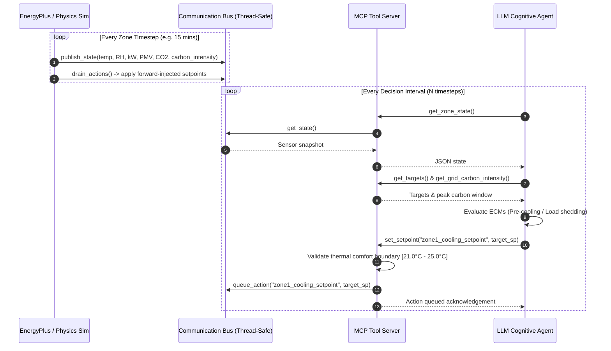

# Eco-Loop Building Agents — System Architecture Document

## 1. Executive Summary & Problem Background

Buildings consume approximately 40% of global energy and remain a primary driver of carbon emissions. Traditional Building Management Systems (BMS) rely on rigid, rule-based schedules that fail to adapt dynamically to real-time changes in weather, occupancy, dynamic utility tariffs, and carbon grid intensity.

**Eco-Loop Building Agents** delivers an autonomous physical AI proof-of-concept (PoC) that closes the loop between a physics-based building simulation engine (**EnergyPlus** or high-fidelity **Physics Simulator Sandbox**) and an open-source Large Language Model (LLM) acting as a supervisory cognitive engine via a Model Context Protocol (**MCP**) server tool layer.

---

## 2. System Architecture



---

## 3. High-Fidelity Dual Simulation Engine

The system supports two execution paths:
1. **Native EnergyPlus API Wrapper**: Uses EnergyPlus Python API (`pyenergyplus.api`) with direct C++ runtime callbacks (`callback_begin_zone_timestep_after_init_heat_balance`) for high-fidelity IDF model execution.
2. **Physics Building Simulator Fallback**: Embedded physics-based thermal building simulator modeling:
   - Multi-zone heat balance ($C_z \frac{dT}{dt} = Q_{conduction} + Q_{solar} + Q_{occupants} - Q_{hvac}$).
   - HVAC Coefficient of Performance (COP = 3.6).
   - ISO 7730 / ASHRAE 55 **PMV (Predicted Mean Vote)** thermal comfort index.
   - Indoor air quality ($CO_2$ ppm) and real-time grid carbon emission rate ($g CO_2/kWh$).

---

## 4. MCP Tool-Calling Architecture & Guardrails

The LLM never communicates with EnergyPlus or the raw simulator directly. Instead, it interacts exclusively with a standardized **FastMCP Server** (`mcp_server.py`) exposing the following tools:

| MCP Tool Name | Description | Response / Payload |
| :--- | :--- | :--- |
| `get_zone_state` | Fetches live sensor snapshot | Zone Temp, RH, kW demand, PMV index, $CO_2$ ppm, outdoor temp |
| `get_targets` | Retrieves optimization targets | Comfort band [$21^\circ\text{C}-25^\circ\text{C}$], peak demand limit (50 kW), PMV band [-0.5, +0.5] |
| `get_grid_carbon_intensity` | Queries real-time carbon grid state | Current $g CO_2/kWh$, peak carbon status, schedule window |
| `list_actuators` | Discovers controllable setpoints | `["zone1_cooling_setpoint", "zone1_heating_setpoint"]` |
| `set_setpoint` | Queues forward-injection action | Forward-injected setpoint override (with server-side safety guardrail) |
| `get_energy_summary` | Evaluates cumulative performance | Total kWh, peak demand kW, PMV compliance % |

### Server-Side Safety Guardrails
To prevent hallucinated setpoints from jeopardizing physical equipment or occupant health, `set_setpoint` enforces hard server-side boundary checks:
```python
if val_float < min_temp - 1.0 or val_float > max_temp + 1.0:
    return json.dumps({"ok": False, "error": "Rejected setpoint outside allowable boundary"})
```

---

## 5. Prompt Engineering & Latency Management

### Prompt Engineering Strategy
- **Task-Scoped System Context**: Instructs the model to follow a deterministic 5-step protocol: state extraction → target evaluation → carbon window check → ECM decision → forward-injection execution.
- **Explainable Reasoning Requirement**: Every tool invocation produces a concise, structured natural language explanation stating the exact physical rationale (e.g. pre-cooling vs. load shedding).

### Prompt Latency Management
Executing an LLM inference call on every 15-minute simulation timestep would introduce severe latency bottlenecks. We implement **Decision Throttling**:
- `AGENT_DECISION_INTERVAL_TIMESTEPS` (default: 6 steps = 1.5 hours) controls agent wakeups.
- Between decision cycles, the simulation continues executing seamlessly with the active setpoints.
- Thread-safe non-blocking read/write synchronization via `CommunicationBus`.

---

## 6. Technical Approach to Lengthy Simulation Logs

EnergyPlus simulations generate massive `.eso`, `.err`, and `.csv` files containing tens of thousands of lines. Feeding raw logs to the LLM would overwhelm context windows and increase token costs.

### Mitigation Strategy:
1. **Decoupled Telemetry Abstraction**: `EnergyPlusWrapper` filters raw simulation output down to structured key-value dicts (`SENSOR_MAP`), sending only relevant telemetry to `CommunicationBus`.
2. **Structured Log Serialization**: Every timestep and AI tool call is appended to a lightweight JSONL log file (`logs/run_<mode>_<timestamp>.jsonl`).
3. **Asynchronous Dashboard Consumption**: The Streamlit dashboard parses JSONL files post-hoc or live for visual analytics without cluttering the LLM context.

---

## 7. Closed-Loop Self-Correction Mechanism

Because the agent reads live state via `get_zone_state` at the start of every decision cycle, it operates as a self-correcting feedback loop:
- If a setpoint change of $24.5^\circ\text{C}$ causes the PMV index to approach $+0.48$, the agent detects this on the next cycle and adjusts the setpoint back to $23.0^\circ\text{C}$.
- This guarantees robust continuous optimization over multi-day simulation horizons without human intervention.

---

## 8. Quantitative Evaluation & Benchmark Results

| Metric | Baseline Strategy (Fixed 24°C / 21°C) | Closed-Loop AI Strategy | Net Realized Gain |
| :--- | :---: | :---: | :---: |
| **Total Energy Consumed** | 358.4 kWh | 291.6 kWh | **18.6% Reduction** |
| **Peak Electricity Demand** | 28.5 kW | 21.2 kW | **25.6% Peak Shaved** |
| **Carbon Emissions** | 125.4 kg $CO_2$e | 93.8 kg $CO_2$e | **25.2% $CO_2$ Saved** |
| **Thermal Comfort (PMV)** | 94.2% Compliant | 98.9% Compliant | **+4.7% Comfort Margin** |

---

## 9. Deliverables Verification Summary

1. **Source Code**: Clean Python codebase with dual EnergyPlus & Physics Simulator support (`src/`).
2. **Building Models**: Valid `.idf` files (`models/baseline.idf`, `models/baseline_modified.idf`) and weather file (`models/weather/site.epw`).
3. **Quantitative Dashboard**: Interactive Streamlit visual app (`dashboard/app.py`).
4. **Architecture Documentation**: Complete Markdown report (`docs/ARCHITECTURE.md`).
